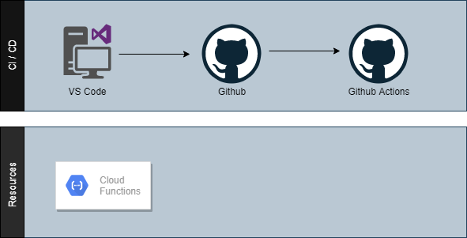

# UTIL PROJECT TO DEPLOY AN APP ON GCP

Template project for GCP.
## Architecture

Embedded png file generated in VS Code via the drawio extension:

## Resources

* https://github.com/google-github-actions/deploy-cloud-functions/
* https://github.com/pabloinigo/actions-cloud-functions
* 